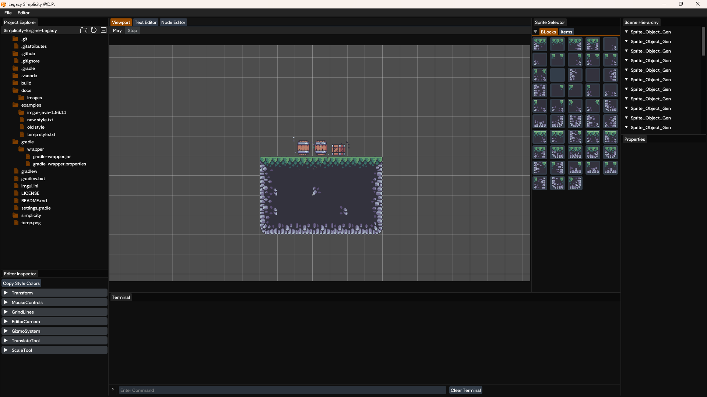
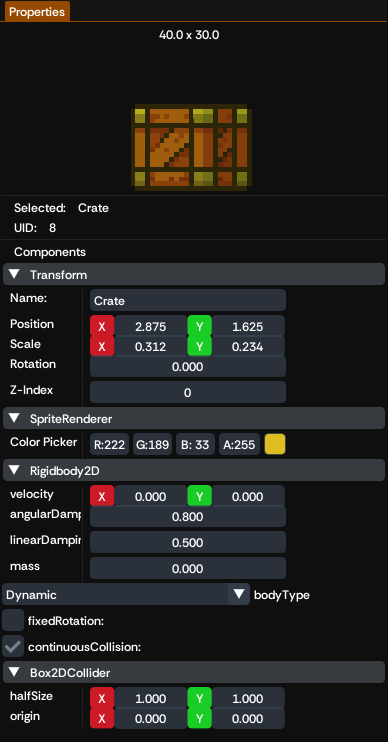

# Simplicity Engine (Legacy)

A 2D Java game engine built in 2023 as a personal learning project, following along with
[GamesWithGabe's](https://www.youtube.com/@GamesWithGabe) game engine series. Simplicity engine is considered a **legacy** project, built in Java with LWJGL. I rarely maintain it, and is shared publicly as a reference for anyone else following the same
series or exploring 2D engine architecture.


| Editor | Inspector |
| --- | --- |
|  |  |

## Status

This project is **archived / legacy**. It was my first attempt at engine development and the project has known gaps, incomplete features, dead code paths, and areas that don't work
end-to-end. It's kept around for learning purposes and as a historical snapshot.

Active development has moved to a new engine, **Quinoa**, which follows an entirely
different architecture from Simplicity and is currently not publicly available.

## Trying the app

Check [`windows` release](https://github.com/clydepena/Simplicity-Engine-Legacy/releases/tag/windows).

## Core Mechanics

The engine (in `simplicity/`) is built around a component-based `GameObject`/`Scene`
model, similar in spirit to engines like Unity:

- **Renderer** — OpenGL-based 2D rendering via LWJGL: batched sprite rendering,
  framebuffers, shaders, debug line drawing, and mouse-picking.
- **Physics2D** — 2D physics built on JBox2D, exposed as components.
- **Scenes** — `Scene` / `SceneInitializer` abstractions for loading and running levels.
- **Editor** — an in-engine level editor built with Dear ImGui (via `imgui-java`),
  including a scene hierarchy, project/file explorer, properties window, sprite
  selector, node editor, text editor, and logger window.
- **Serialization** — scenes and game objects are saved/loaded as JSON (GSON).
- **Assets** — fonts, shaders, and spritesheets under `simplicity/assets/`.

## Tech stack

- Java 23 (Gradle toolchain)
- [LWJGL 3.3.3](https://www.lwjgl.org/) (GLFW, OpenGL, OpenAL, STB, Assimp)
- [JOML](https://github.com/JOML-CI/JOML) for math
- [Dear ImGui (imgui-java)](https://github.com/SpaiR/imgui-java) for editor UI
- [JBox2D](https://github.com/jbox2d/jbox2d) for physics
- [Gson](https://github.com/google/gson) for JSON serialization
- Gradle, with optional GraalVM native-image support

## Building & running

Requires a JDK 23 toolchain (Gradle will provision one via the toolchain plugin if
needed).

```bash
# Build the project
./gradlew build

# Run the editor/engine
./gradlew run
```

Other useful tasks (run from `simplicity/`, or with `-p simplicity` from the root):

```bash
# Download runtime natives/dependencies into libs/
./gradlew download

# Build a native image with GraalVM
./gradlew nativeCompile

# Package a native app image/installer with jpackage
./gradlew jpackage
```

## Repository layout

```
simplicity/       Engine source, assets, and Gradle module
examples/         Vendored third-party example projects (e.g. imgui-java samples)
```

## License

Released into the public domain under the [Unlicense](LICENSE).
